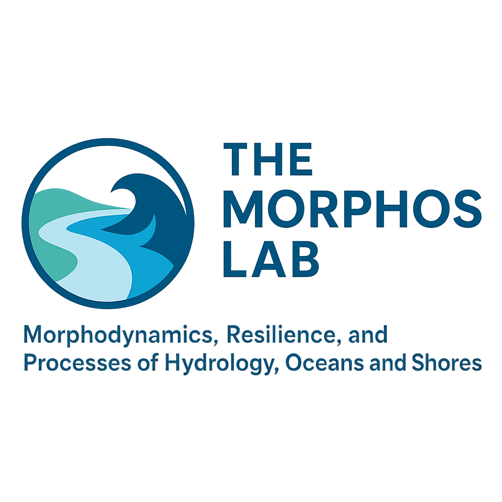

<!-- Link to external CSS (Make sure the style.css is in the same directory) -->
<link rel="stylesheet" href="style.css">

# Welcome to MORPHOS Lab!

<!-- Updated Header with Flexbox layout -->
<header>
  

     <!-- Adjust the width here if needed -->
    <h1>The MORPHOS Lab</h1>
  

  
Morphodynamics, Resilience, and Processes of Hydrology, Oceans, and Shores

</header>

---

<!-- Navigation Bar (added links to scroll to sections) -->
<nav>
  <ul style="list-style-type:none; padding: 0;">
    <li style="display:inline; margin-right: 20px;"><a href="#about">About</a></li>
    <li style="display:inline; margin-right: 20px;"><a href="#research">Research</a></li>
    <li style="display:inline; margin-right: 20px;"><a href="#people">People</a></li>
    <li style="display:inline; margin-right: 20px;"><a href="#publications">Publications</a></li>
    <li style="display:inline; margin-right: 20px;"><a href="#projects">Projects</a></li>
    <li style="display:inline; margin-right: 20px;"><a href="#contact">Contact</a></li>
  </ul>
</nav>

---

## About the Lab

We study how hydrodynamics and sediment transport shape coastal and estuarine landscapes, with an emphasis on climatic drivers, complex morphologies, and their role in flooding, erosion, and ecosystem stability. Our goal is to advance knowledge that underpins sound management of flooding hazards, sustainable port development, and resilient coastal ecosystems.

---

## Research Areas

- Coastal delta morphodynamics
- River–floodplain–coastal interactions
- Coastal flooding and hazards
- Hydrology & hydrogeology
- Physical oceanography
- Buoyancy-driven flows
- Numerical & process-based modeling
- Coastal & environmental engineering

---

## Ongoing Projects

Here are some of the exciting projects that we are currently working on:

### 1. **Project Name 1**  
   A brief description of your project. This could include objectives, methods, or key findings.  
   [Link to more details](#)

### 2. **Project Name 2**  
   A brief description of another project. Again, you can link to further details or publications here.  
   [Link to more details](#)

### 3. **Project Name 3**  
   A brief description of another ongoing project.  
   [Link to more details](#)

---

## People

Meet the team behind the MORPHOS Lab. (Add PI, students, and collaborators here.)

---

## Publications

A selection of our recent research papers and conference presentations. (Link to Google Scholar here.)

---

## Contact

Email: [hvundavilli@coastal.edu](mailto:hvundavilli@coastal.edu)

Department of Coastal and Marine Systems Science, Coastal Carolina University

---

<!-- Footer (HTML for consistency) -->
<footer>
  
&copy; 2025 The MORPHOS Lab | Coastal Carolina University

</footer>
